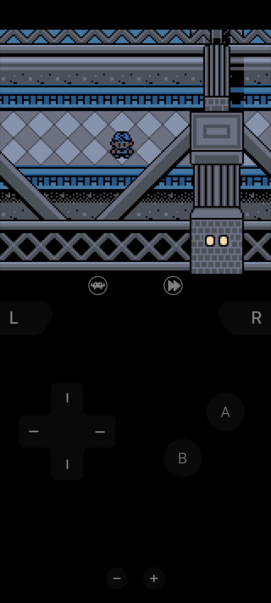
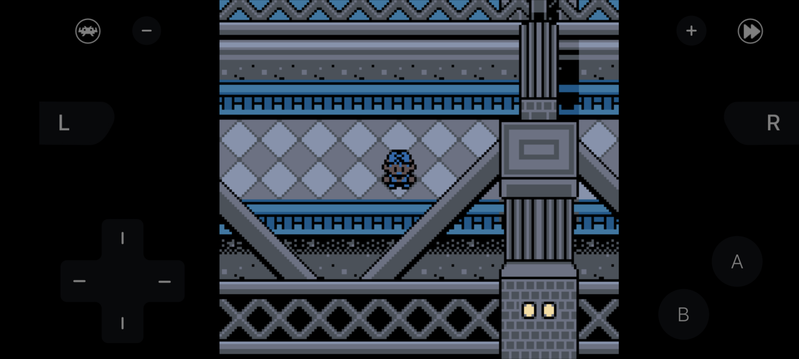

# TODO
- [ ] Make fitting RetroArch meta buttons
- [ ] Implement outline ver. overlay

# Screenshots
|               | Portrait      | Landscape     |
| ------------- | ------------- | ------------- |
| <b> No Outline </b> |  |  |
| <b> Outline </b> | TODO  | TODO |

Captured on a Google Pixel 7a